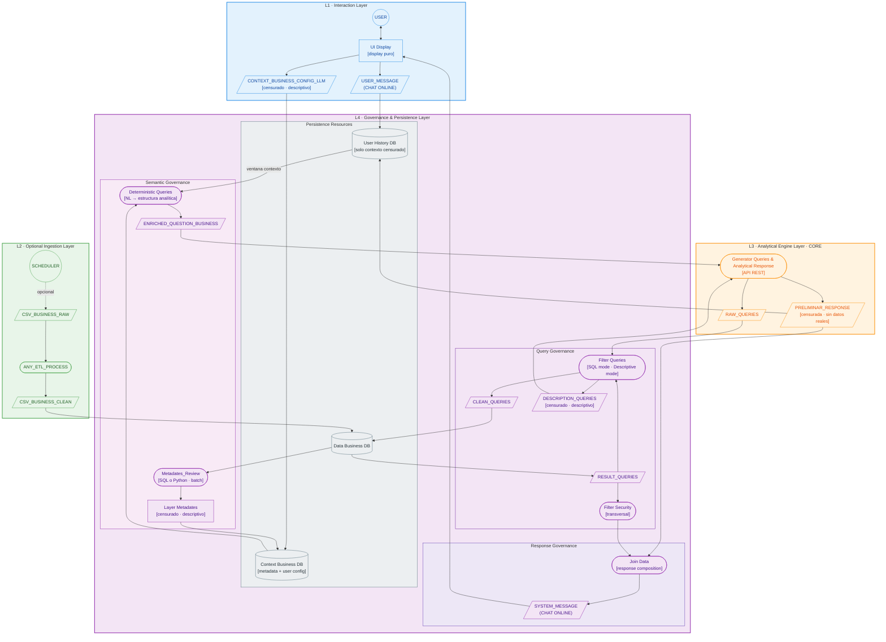

# Arquitectura LLM SQL Governada

## Propuesta Técnica

## 1. Objetivo

El sistema permite que usuarios de negocio consulten información analítica en lenguaje natural, sin necesidad de saber SQL ni la estructura interna de la base.

El usuario escribe una consulta como:

> “¿Cuántas ventas tuvimos en marzo por región?”

y recibe una respuesta narrativa, gobernada y basada en datos reales. 📊

---

## 2. Principios de diseño

La arquitectura está organizada en **4 layers funcionales**:

| Layer                                   | Responsabilidad                      |
| --------------------------------------- | ------------------------------------ |
| **L1 · Interaction Layer**              | Entrada y salida del usuario         |
| **L2 · Optional Ingestion Layer**       | Carga y transformación de datos      |
| **L3 · Analytical Engine Layer**        | Generación analítica con LLM         |
| **L4 · Governance & Persistence Layer** | Gobernanza, seguridad y persistencia |

La idea central es simple:
el usuario interactúa solo con la capa de interfaz; el engine razona sobre contexto y metadata; y todo acceso a datos reales pasa por gobernanza. 🔒

---

## 3. Separación entre dato y almacenamiento

Acá conviene distinguir dos cosas:

* **dato lógico**: el contenido que circula por el sistema,
* **storage / persistencia**: el lugar físico donde ese dato se guarda.

### Datos lógicos

| Dato                         | Qué representa                      |
| ---------------------------- | ----------------------------------- |
| `USER_MESSAGE`               | Pregunta del usuario                |
| `ENRICHED_QUESTION_BUSINESS` | Pregunta analítica enriquecida      |
| `RAW_QUERIES`                | SQL generado por el engine          |
| `RESULT_QUERIES`             | Resultado real devuelto por la base |
| `DESCRIPTION_QUERIES`        | Resumen censurado del resultado     |
| `PRELIMINAR_RESPONSE`        | Respuesta narrativa preliminar      |
| `SYSTEM_MESSAGE`             | Respuesta final para mostrar        |

### Persistencia por etapa

| Etapa         | Persistencia lógica                                 | Soporte físico                                                                                                 |
| ------------- | --------------------------------------------------- | -------------------------------------------------------------------------------------------------------------- |
| **PoC / MVP** | `data_business`, `context_business`, `user_history` | **3 schemas en PostgreSQL**                                                                                    |
| **Scale**     | `data_business`, `context_business`, `user_history` | `context_business` y `user_history` pasan a **2 buckets** separados; `data_business` queda como base operativa |

### Qué guarda cada persistencia

| Recurso            | Guarda                                             |
| ------------------ | -------------------------------------------------- |
| `data_business`    | Datos reales del negocio                           |
| `context_business` | Metadata, configuración y contexto semántico       |
| `user_history`     | `USER_MESSAGE` y contexto conversacional censurado |

---

## 4. Arquitectura por layers

---

## L1 · Interaction Layer

Esta capa es el único punto de contacto con el usuario.

| Nodo                          | Tipo        | Descripción                            |
| ----------------------------- | ----------- | -------------------------------------- |
| `USER`                        | Actor       | Usuario de negocio                     |
| `UI_DISPLAY`                  | Frontend    | Interfaz visual de chat                |
| `USER_MESSAGE`                | Data Object | Mensaje de entrada en lenguaje natural |
| `CONTEXT_BUSINESS_CONFIG_LLM` | Data Object | Configuración contextual censurada     |
| `SYSTEM_MESSAGE`              | Data Object | Respuesta final mostrada al usuario    |

**Responsabilidad:** capturar la consulta, transmitir el contexto necesario y mostrar la respuesta.
No interpreta SQL ni accede a datos reales. 🧩

---

## L2 · Optional Ingestion Layer

Esta capa gestiona la carga batch de datos hacia la base de negocio. No participa del flujo online del usuario.

| Nodo                 | Tipo        | Descripción                     |
| -------------------- | ----------- | ------------------------------- |
| `SCHEDULER`          | Workflow    | Dispara procesos programados    |
| `CSV_BUSINESS_RAW`   | Data Object | Archivo crudo de entrada        |
| `ANY_ETL_PROCESS`    | Workflow    | Limpieza y transformación       |
| `CSV_BUSINESS_CLEAN` | Data Object | Archivo limpio listo para carga |

**Responsabilidad:** preparar datos externos para su incorporación al sistema.
Es una capa opcional y desacoplada del flujo conversacional. ⚙️

---

## L3 · Analytical Engine Layer · CORE

Es el núcleo analítico del sistema. Recibe una estructura enriquecida, genera SQL y produce una respuesta preliminar.

| Nodo                  | Tipo          | Descripción                    |
| --------------------- | ------------- | ------------------------------ |
| `GEN_QUERIES`         | API / Service | Engine principal de generación |
| `RAW_QUERIES`         | Data Object   | SQL sin validar                |
| `PRELIMINAR_RESPONSE` | Data Object   | Respuesta narrativa censurada  |

**Responsabilidad:**

* interpretar la intención analítica,
* generar consultas,
* construir una narrativa preliminar,
* trabajar sobre metadata y contexto, no sobre datos crudos.

---

## L4 · Governance & Persistence Layer

Es la capa crítica. Controla el acceso a datos reales, la seguridad, la validación y la composición final de la respuesta.

---

### 4.1 Semantic Governance

Convierte lenguaje natural en una estructura analítica consistente.

| Nodo               | Tipo        | Descripción                                |
| ------------------ | ----------- | ------------------------------------------ |
| `METADATES_REVIEW` | Workflow    | Extracción batch de metadata desde la base |
| `LAYER_METADATES`  | Data Object | Metadata descriptiva censurada             |
| `DET_QUERIES`      | Service     | Convierte NL en estructura analítica       |
| `ENRICHED_Q`       | Data Object | Pregunta enriquecida para el engine        |

**Inputs principales:**

* `USER_MESSAGE`
* `CONTEXT_BUSINESS`
* `USER_HISTORY` como **storage de contexto**, no como input lógico

**Output principal:**

* `ENRICHED_QUESTION_BUSINESS`

---

### 4.2 Query Governance

Valida y controla toda query generada por el engine antes de tocar la base real.

| Nodo                  | Tipo               | Descripción                         |
| --------------------- | ------------------ | ----------------------------------- |
| `FILTER_QUERIES`      | Service            | Valida y sanitiza SQL               |
| `CLEAN_QUERIES`       | Data Object        | Query validada                      |
| `RESULT_QUERIES`      | Data Object        | Resultado real de la DB             |
| `DESCRIPTION_QUERIES` | Data Object        | Descripción censurada del resultado |
| `FILTER_SECURITY`     | Security Component | Filtrado transversal de seguridad   |

**Validaciones principales:**

* solo `SELECT`,
* allowlist de tablas,
* límite de filas,
* sanitización SQL,
* control de joins y comportamiento explosivo. 🔐

---

### 4.3 Response Governance

Compone la respuesta final a partir de la narrativa preliminar y los resultados filtrados.

| Nodo        | Tipo        | Descripción                       |
| ----------- | ----------- | --------------------------------- |
| `JOIN_DATA` | Service     | Composición final de la respuesta |
| `SYS_MSG`   | Data Object | Respuesta final para la UI        |

---

### 4.4 Persistence Resources

Los recursos de persistencia sostienen todo el sistema.

| Recurso               | Tipo    | Contenido                            |
| --------------------- | ------- | ------------------------------------ |
| `Data Business DB`    | Storage | Datos reales del negocio             |
| `Context Business DB` | Storage | Metadata + configuración de contexto |
| `User History DB`     | Storage | `USER_MESSAGE` + historial censurado |

---

## 5. Flujo funcional

| Paso | Qué ocurre                                                                   |
| ---- | ---------------------------------------------------------------------------- |
| 1    | El usuario escribe una pregunta en la UI                                     |
| 2    | `USER_MESSAGE` entra en la capa de interacción                               |
| 3    | `USER_MESSAGE` se almacena en `USER_HISTORY` junto con el contexto censurado |
| 4    | Semantic Governance arma `ENRICHED_QUESTION_BUSINESS`                        |
| 5    | El engine genera `RAW_QUERIES` y `PRELIMINAR_RESPONSE`                       |
| 6    | Query Governance valida la query                                             |
| 7    | La base ejecuta la consulta y devuelve `RESULT_QUERIES`                      |
| 8    | Security filtra lo sensible                                                  |
| 9    | Response Governance compone `SYSTEM_MESSAGE`                                 |
| 10   | La UI lo muestra al usuario                                                  |

---

## 6. Evolución por etapa

### PoC

Objetivo: validar el flujo completo de lenguaje natural → SQL → respuesta narrativa con el menor nivel de infraestructura posible.

| Componente    | Tecnología                        |
| ------------- | --------------------------------- |
| Orquestación  | n8n                               |
| Engine LLM    | Gemini API                        |
| Base de datos | PostgreSQL o SQLite               |
| Metadata      | Extracción manual o script simple |
| Ingesta       | CSV cargado manualmente           |

### MVP

Objetivo: pasar de validación a una solución usable, manteniendo una arquitectura simple pero más gobernada.

| Componente            | Tecnología                           |
| --------------------- | ------------------------------------ |
| Orquestación auxiliar | n8n                                  |
| Engine LLM            | FastAPI + Gemma con function calling |
| Base de datos         | PostgreSQL                           |
| Governance            | Python scripts o nodos controlados   |
| Metadata              | Script batch periódico               |
| Historial             | Tabla simple en PostgreSQL           |

---

## 7. Diagramas Mermaid

### Scale Up

